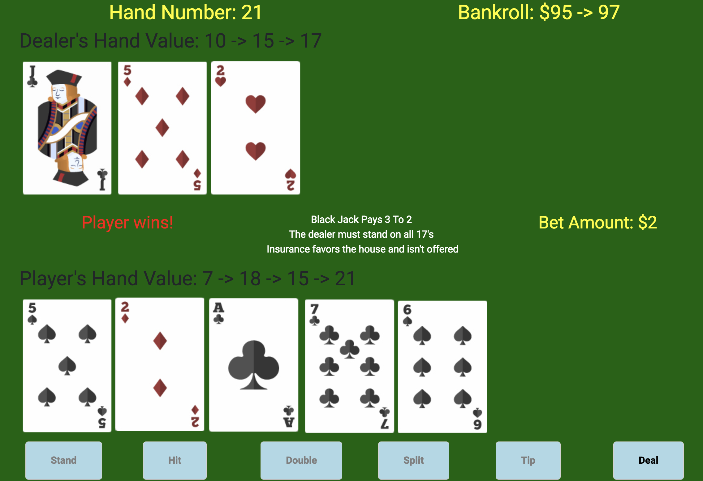

# Blackjack Online Poker

### Created by Jason Caldwell
##### December 2017

## Program Overview
An online blackjack poker game. The person closest to 21 without going over wins!

A player is given a fixed stack size for their session. Each hand (round) consists of:
* The deck getting shuffled.
* The player is dealt 2 cards face up and the dealer is dealt 1 card face up and another 1 face down.
* If either person has 21 they win with Blackjack and the hand is over.
* There are 6 event actions to chose from. The player can chose to:
  * Hit: get one more card. Player can hit as many times as desired as long as their point total is under 21.
  * Stand: keep their current point total and end their turn.
  * Double: double their bet size and get one more card.
  * Split: split their one hand into 2 hands. This is only allowed when the cards are the same rank.
  * Tip: get a hint about what the correct decision is based off of the mathematical odds. Tips are offered for hard, soft, and split hands. There are many decisions that are not obvious in blackjack (which is profitable for the casinos and why the game is offered everywhere).
  * Deal: deal a new round. This option is only available after the hand has ended.
* If the player busts (goes over 21) the dealer wins.
* Otherwise, once the player stands the dealer has to hit until they have a total of 17 or more.
* If the dealer busts the player wins.
* Otherwise, the point values of the two hands are compared and the person with the higher hand value wins. A push (tie) is also possible.

### Sample Hand

### Installation
* Developed in JavaScript.

## Programming Principles
* Variables
* Decisions
* Functions
* Loops
* JavaScript Objects
* Event Driven Programming
  * Hit, Stand, Double, Split, Tip, Deal
* Keyboard Shortcuts
  * Hit: 'h', 'H', and 1
  * Stand: 's', 'S', and 2
  * Double: 'd', 'D', and 3
  * Split: 'p', 'P', and 4
  * Tip: 't', 'T', and 5
  * Deal: 'e', 'E', 6, and enter

### Future Enhancements
* Complete split functionality

### Licensing
See the file called LICENSE.

### About the developer
To see additional information and other projects please visit my [personal website](http://jdcald13.com).
